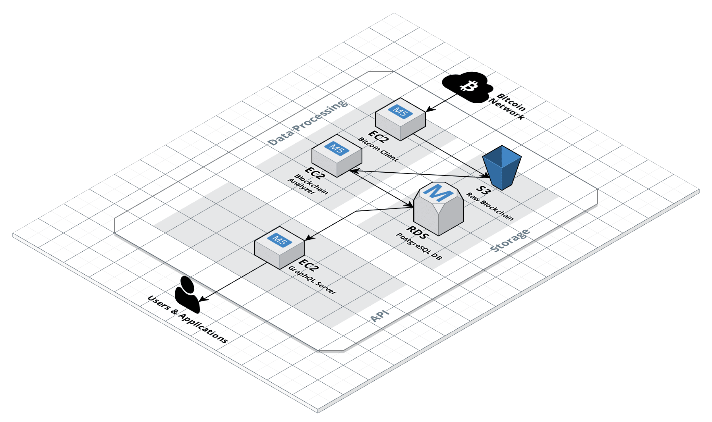

# Blockchain API

The `blockchain_api`

* leverages (bitcoin) blockchain data from a Postgres database that has been imported with our 
[blockchain_analyzer](https://github.com/blockninjas/blockchain_analyzer) tool,
*  and exposes the data as typed GraphQL API making it comfortable to query the blockchain data.

## Running

To get the API up and running, a Postgres database has to be installed first. The database schema 
and the normalized data can then be automatically created and imported with our  
[blockchain_analyzer](https://github.com/blockninjas/blockchain_analyzer) tool.

In order to provide proper access to the Postgres database, `config/dev.exs` has to parameterized 
with the respective database connection settings. When running in production, this should be done by 
using `prod.secret.exs` as explained in `config/prod.exs`.

Then, to finally start our Phoenix server and expose the GraphQL API:

* Install dependencies with `mix deps.get`
* Start Phoenix endpoint with `mix phx.server`

Now you can visit [`localhost:4000/api/graphiql`](http://localhost:4000/api/graphiql) from your browser 
to open the interactive GraphQL in-browser IDE.

Ready to run in production? Please [check the Phoenix deployment guides](https://hexdocs.pm/phoenix/deployment.html).

## Static Code Analysis

We use [Dialyzer](http://erlang.org/doc/man/dialyzer.html), a static code analysis tool for Erlang, 
making it easier to find software discrepancies in our code base. It can be started as mix task via:

    $ mix dialyzer
    
    
Furthermore, [credo](https://github.com/rrrene/credo) is used to improve code consistency which can 
also be started as mix task via:

    $ mix credo
    
## Testing

TODO 